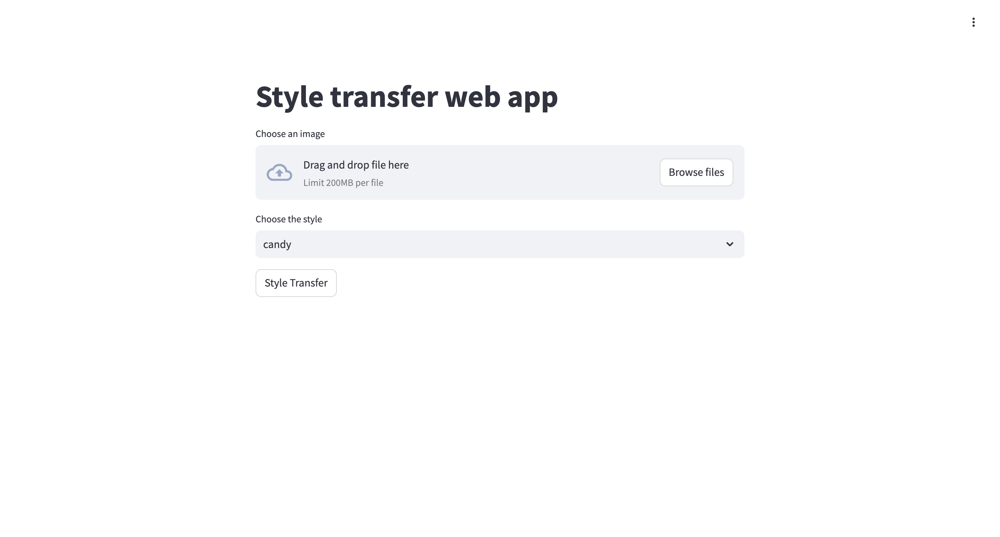
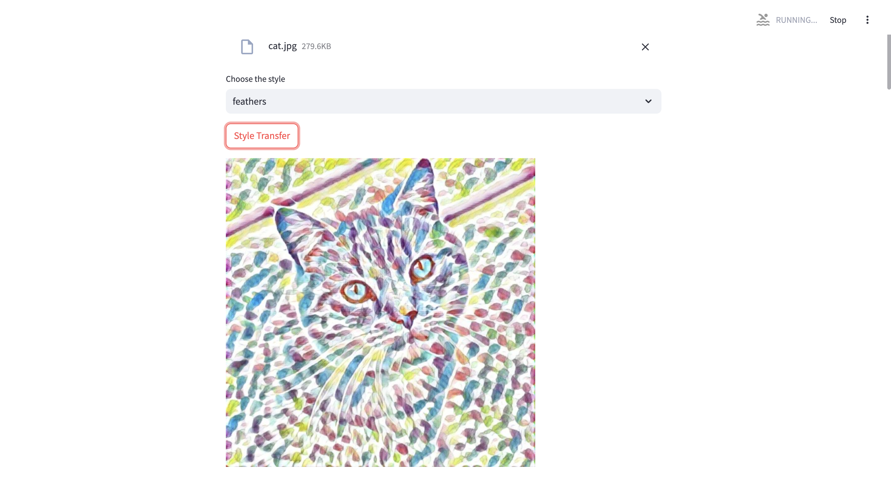
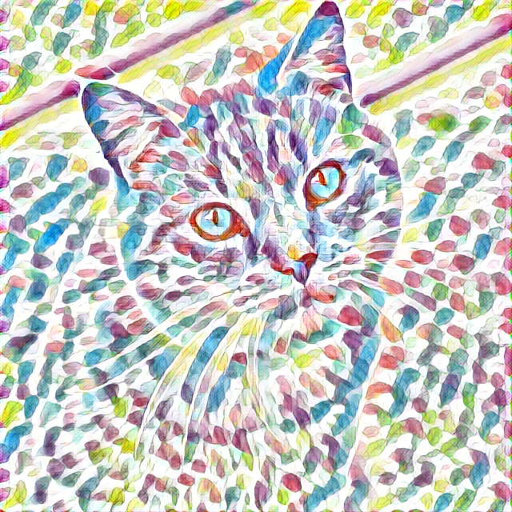

## ML Image Processing With Neural Networks, Streamlit and FastAPI

### Overview

This project is a web application that brings the power of neural networks to your fingertips. With a sleek frontend built on Streamlit and a robust FastAPI backend, it allows users to effortlessly transform their images into works of art. Simply upload an image, choose a style from our selection of pre-trained models, and watch as your image is instantly transformed.

- [Features](#features)
- [Available Styles](#available-styles)
- [Project Structure](#project-structure)
   - [Frontend](#frontend)
   - [Backend](#backend)
   - [Shared Resources](#shared-resources)
- [How to Run](#how-to-run)
   - [Prerequisites](#prerequisites)
   - [Step-by-Step Instructions](#step-by-step-instructions)
   - [Stopping the application](#stopping-the-application)
- [App Example](#app-example)
- [Credits](#credits)

#### Features

- **Upload Image:** Users can upload an image file from their local device.
- **Select Style:** Choose from a variety of pre-trained artistic styles.
- **Style Transfer:** The selected style is applied to the uploaded image using a deep learning model, and the resulting image is displayed to the user.

#### Available Styles

The application currently supports the following styles:

- Candy
- Composition VI
- Feathers
- La Muse
- Mosaic
- Starry Night
- The Scream
- The Wave
- Udnie

#### Project Structure

The project is organized into two main components:

##### Frontend

- **Framework:** Built with Streamlit for an interactive user experience.
- **Directory:** Organized under frontend/ for easy navigation.
- **Entry Point:** Launch the frontend via frontend/main.py.
- **Dockerfile:** Dockerized with frontend/Dockerfile for smooth deployment.

##### Backend

- **Framework:** Powered by FastAPI to handle backend processes efficiently.
- **Directory:** All backend logic is contained within backend/.
- **Entry Point:** Start the backend with backend/main.py.
- **Model Inference:** Image processing handled by backend/inference.py.
- **Configuration:** Settings are managed in backend/config.py.
- **Dockerfile:** Easily deployable via backend/Dockerfile.

##### Shared Resources

- **Models:** Pre-trained models for style transfer are stored in the `backend/models/` directory. These must be downloaded, as explained in setup.
- **Storage:** The `storage/` directory is shared between the frontend and backend for saving and accessing processed images.

#### How to Run

##### Prerequisites

Ensure Docker and Docker Compose are installed on your system to get started.

##### Step-by-Step Instructions

1. **Clone the repository:**
   ```bash
   git clone https://github.com/chris-guerra/style-shift-ml.git
   cd style-shift-ml
   ```
2. **Download models:**
```bash
sh download_models.sh
```
2. **Build and start the application:**
   ```bash
    docker compose up --build -d
   ```
3. Access the application:

Frontend: Open your browser and go to http://localhost:8501 to interact with the web app.
Backend: The API is accessible at http://localhost:8080.

##### Stopping the application
```bash
docker compose down
```

#### App Example

Below are some examples showcasing the application's functionality:

**Streamlit Application:**

<div style="text-align: center;">
    
</div>

**Streamlit Application With Processed Image:**

<div style="text-align: center;">
    
</div>

**Input Image:**

<div style="text-align: center;">
    
</div>

**Output Image:**

<div style="text-align: center;">
    
</div>

#### Credits:

Special thanks to the resources that inspired and guided this project:

[Youtube Video](https://www.youtube.com/watch?v=cCsnmxXxWaM))
